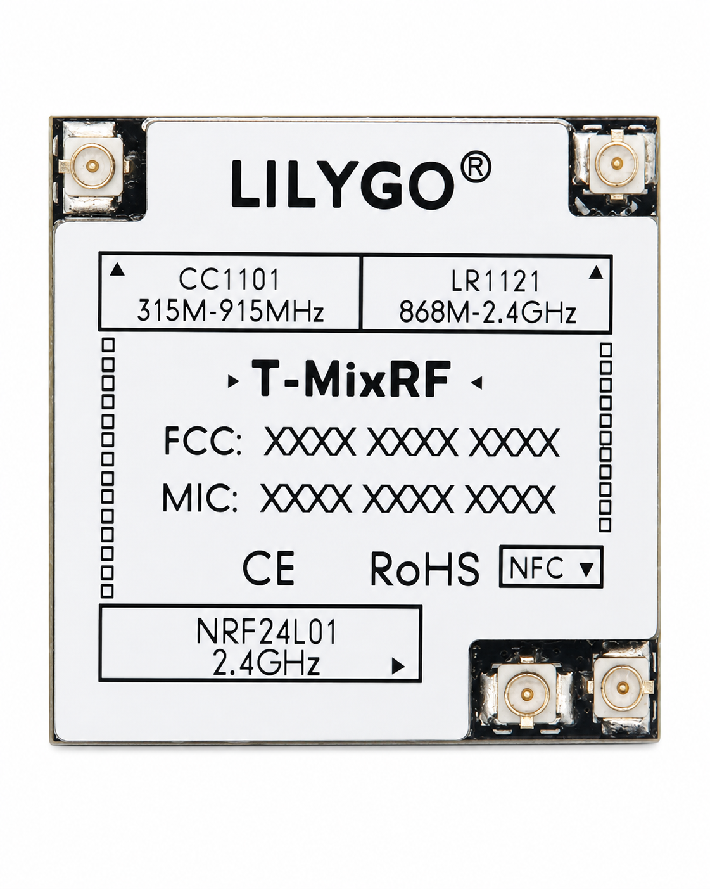
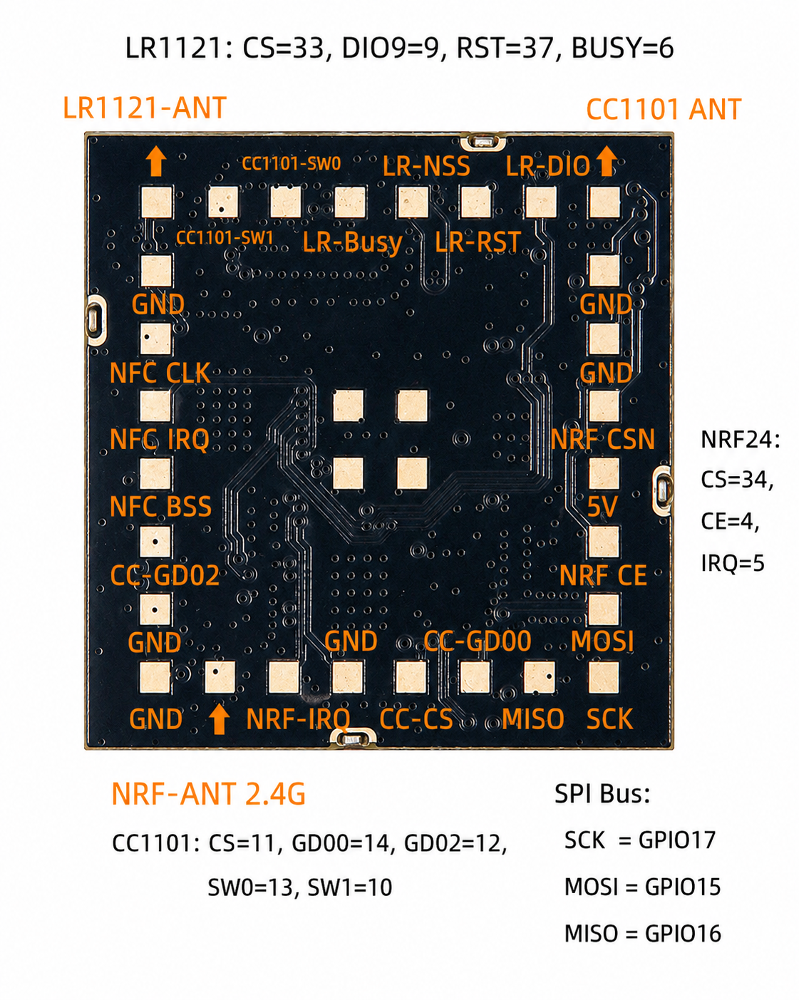

<h1 align = "center">🏆T-MixRF🏆</h1>

| Front | Back |
| :---: | :---: |
|  |  | 


Multi-protocol RF Development Board supporting various wireless communication standards

## Hardware Specifications

| Item | Parameter |
|------|----------|
| Main Chip | ESP32-S3-WROOM-1-N16R8 |
| CPU | Xtensa® dual-core 32-bit LX7 |
| Clock Speed | 240MHz |
| Memory | 16MB Flash + 8MB PSRAM |
| Operating Voltage | 3.3V |

## Module Functions

### 1. LR1121 LoRa Module
- **Frequency Bands**:
  - 150~960 MHz (Sub-GHz)
  - 2400~2500 MHz (2.4GHz)
- **Max Transmit Power**:
  - Sub-GHz: 22 dBm
  - 2.4GHz: 13 dBm
- **SPI Interface**: CS(33), DIO9(9), RST(37), BUSY(6)
- **Use Cases**: Long-range communication, LoRaWAN, remote transmission

### 2. CC1101 Sub-GHz Module
- **Frequency Support**: 315 / 433 / 868 / 915 MHz
- **SPI Interface**: CS(11), GDO0(14), GDO2(12)
- **Band Switching**: Controlled via SW0/SW1 pins
- **Use Cases**: Low-cost remote control, security systems, home appliances

### 3. NRF24L01 2.4GHz Module
- **Frequency**: 2400~2525 MHz
- **SPI Interface**: CS(34), CE(4), IRQ(5)
- **Features**: Low power consumption, multi-receiver support
- **Use Cases**: 2.4GHz wireless communication, sensor networks

### 4. ST25R3916 NFC Module
- **Supported Protocols**: ISO14443A/B, ISO15693, ISO18092, NFCIP-1
- **Functions**: NFC tag read/write, card emulation, peer-to-peer communication
- **SPI Interface**: BSS(36), EN(35)
- **Use Cases**: NFC application development, access control systems, electronic payments

## Example Programs

| Example | Description |
|---------|-------------|
| `CC1101_send/CC1101_recv` | CC1101 send/receive test |
| `LR1121_send/LR1121_recv` | LR1121 LoRa send/receive test |
| `NRF24_send_1/NRF24_recv_1` | NRF24L01 basic communication test |
| `NRF24_send_2` | NRF24L01 extended features test |
| `NFC/` | NFC tag read/write, NDEF parsing |
| `rf_test/` | Multi-RF module integration test |

## Library Dependencies

- **RadioLib**: LR1121/CC1101/NRF24L01 drivers
- **NFC-RFAL-fork**: ST25R3916 NFC protocol stack
- **RF24-master**: NRF24L01 driver library

## Pin Definitions

```
SPI Bus:
  SCK  = GPIO17
  MOSI = GPIO15
  MISO = GPIO16

LR1121: CS=33, DIO9=9, RST=37, BUSY=6
CC1101: CS=11, GDO0=14, GDO2=12, SW0=13, SW1=10
NRF24:  CS=34, CE=4, IRQ=5
ST25R3916: BSS=36, EN=35
```

## Application Scenarios

- Long-range LoRa IoT communication
- Multi-protocol wireless gateway
- NFC/RFID application development
- Wireless sensor networks
- Remote control and telemetry systems

## Resources

- Hardware schematics: `hardware/` directory
- Board definitions: `boards/` directory

---
[中文版](README_CN.md)